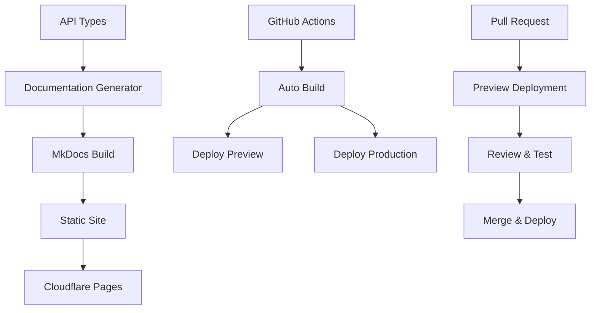

# LlamaStack Operator Documentation

This directory contains the documentation for the LlamaStack Kubernetes Operator, built using [MkDocs](https://www.mkdocs.org/) with the [Material theme](https://squidfunk.github.io/mkdocs-material/).

## 🏗️ Architecture

The documentation follows HyperShift's approach with enhanced features:



## 📁 Structure

```
docs/
├── mkdocs.yml              # MkDocs configuration
├── requirements.txt        # Python dependencies
├── README.md              # This file
├── api-doc-gen/           # API documentation generation config
│   └── config.json        # HyperShift-style API doc config
└── content/               # Documentation content
    ├── index.md           # Homepage
    ├── getting-started/   # Installation and setup guides
    │   ├── installation.md
    │   ├── quick-start.md
    │   └── configuration.md
    ├── how-to/           # Task-oriented guides
    │   ├── deploy-llamastack.md
    │   ├── configure-storage.md
    │   ├── scaling.md
    │   ├── monitoring.md
    │   └── troubleshooting.md
    ├── reference/        # API and configuration reference
    │   ├── api.md        # Generated API documentation
    │   ├── configuration.md
    │   └── cli.md
    ├── examples/         # Real-world examples
    │   ├── basic-deployment.md
    │   ├── production-setup.md
    │   └── custom-images.md
    ├── contributing/     # Development guides
    │   ├── development.md
    │   ├── testing.md
    │   └── documentation.md
    ├── stylesheets/      # Custom CSS
    │   └── extra.css
    └── javascripts/      # Custom JavaScript
        └── extra.js
```

## 🚀 Quick Start

### Prerequisites

- **Go 1.24+** - For API documentation generation tools
- **Python 3.8+** - For MkDocs and dependencies
- **pip3** - Python package manager

### Local Development

1. **Install dependencies**:
   ```bash
   pip install -r requirements.txt
   ```

2. **Generate API documentation**:
   ```bash
   make api-docs
   ```

3. **Build and serve locally**:
   ```bash
   make docs-serve
   ```

4. **Or use the build script**:
   ```bash
   ./scripts/build-docs.sh
   ```

The documentation will be available at `http://localhost:8000`.

## 🛠️ Development

### Adding New Content

1. **Create new markdown files** in the appropriate `content/` subdirectory
2. **Update navigation** in `mkdocs.yml`
3. **Test locally** with `make docs-serve`
4. **Submit a pull request**

### API Documentation

The API documentation is automatically generated from Go type definitions:

- **Source**: `api/v1alpha1/llamastackdistribution_types.go`
- **Config**: `crd-ref-docs.config.yaml`
- **Output**: `docs/content/reference/api.md`

To regenerate API docs:
```bash
make api-docs
```

### Styling and Theming

- **CSS**: Add custom styles to `content/stylesheets/extra.css`
- **JavaScript**: Add functionality to `content/javascripts/extra.js`
- **Theme**: Configure in `mkdocs.yml` under the `theme` section

### Interactive Features

The documentation includes several interactive features:

- **Code copy buttons** - Automatic copy-to-clipboard for code blocks
- **YAML validator** - Validate LlamaStackDistribution configurations
- **Search enhancements** - Improved search with suggestions
- **Navigation aids** - Breadcrumbs, edit links, and page navigation

## 🔧 Configuration

### MkDocs Configuration

The main configuration is in [`mkdocs.yml`](mkdocs.yml):

- **Site metadata** - Title, description, URLs
- **Theme configuration** - Material theme with custom colors
- **Navigation structure** - Page organization
- **Plugins** - Search, Mermaid diagrams
- **Markdown extensions** - Code highlighting, admonitions, etc.

### API Documentation Configuration

API documentation generation is configured in:

- **[`crd-ref-docs.config.yaml`](../crd-ref-docs.config.yaml)** - Main configuration
- **[`api-doc-gen/config.json`](api-doc-gen/config.json)** - HyperShift-style configuration

### Build Configuration

- **[`requirements.txt`](requirements.txt)** - Python dependencies
- **[`../Makefile`](../Makefile)** - Build targets and tool installation
- **[`../scripts/build-docs.sh`](../scripts/build-docs.sh)** - Comprehensive build script

## 🚀 Deployment

### Cloudflare Pages

The documentation is automatically deployed to Cloudflare Pages:

- **Production**: `https://llamastack-k8s-operator.pages.dev`
- **Preview**: Automatic preview deployments for pull requests
- **Configuration**: [`../wrangler.toml`](../wrangler.toml)

### GitHub Actions

Automated builds and deployments are handled by GitHub Actions:

- **Workflow**: [`.github/workflows/docs.yml`](../.github/workflows/docs.yml)
- **Triggers**: Changes to `api/`, `docs/`, or configuration files
- **Features**: Build validation, security scanning, preview deployments

### Manual Deployment

For manual deployments:

```bash
# Build the documentation
make docs-build

# Deploy to Cloudflare Pages (requires wrangler CLI)
wrangler pages deploy docs/site --project-name llamastack-k8s-operator-docs
```

## 📊 Analytics and Monitoring

### Performance Monitoring

- **Build time tracking** - Monitor documentation build performance
- **Page load metrics** - Track user experience
- **Search analytics** - Understand user search patterns

### Content Analytics

- **Popular pages** - Identify most-visited content
- **User flow** - Understand navigation patterns
- **Feedback collection** - Gather user feedback

## 🔍 Quality Assurance

### Automated Checks

- **Link validation** - Check for broken internal and external links
- **Markup validation** - Ensure valid HTML output
- **Accessibility testing** - WCAG 2.1 AA compliance
- **Performance testing** - Page load speed optimization

### Manual Review Process

1. **Content review** - Technical accuracy and clarity
2. **Design review** - Visual consistency and usability
3. **Accessibility review** - Screen reader compatibility
4. **Mobile testing** - Responsive design validation

## 🛡️ Security

### Content Security

- **Input validation** - Sanitize user-generated content
- **XSS protection** - Prevent cross-site scripting
- **CSRF protection** - Secure form submissions

### Deployment Security

- **HTTPS enforcement** - All traffic encrypted
- **Security headers** - Comprehensive security header configuration
- **Dependency scanning** - Regular security updates

## 🤝 Contributing

### Documentation Guidelines

1. **Write for your audience** - Consider user experience level
2. **Use clear headings** - Organize content hierarchically
3. **Include examples** - Provide practical, working examples
4. **Test instructions** - Verify all commands and procedures
5. **Update navigation** - Ensure new content is discoverable

### Style Guide

- **Tone**: Professional but approachable
- **Voice**: Active voice preferred
- **Formatting**: Consistent use of markdown features
- **Code examples**: Complete, runnable examples
- **Screenshots**: High-quality, up-to-date images

### Review Process

1. **Create feature branch** - `docs/feature-name`
2. **Make changes** - Follow style guide
3. **Test locally** - Verify build and functionality
4. **Submit pull request** - Include preview link
5. **Address feedback** - Respond to review comments
6. **Merge and deploy** - Automatic deployment on merge

## 📚 Resources

### Documentation Tools

- **[MkDocs](https://www.mkdocs.org/)** - Static site generator
- **[Material for MkDocs](https://squidfunk.github.io/mkdocs-material/)** - Theme
- **[crd-ref-docs](https://github.com/elastic/crd-ref-docs)** - API documentation generator
- **[Mermaid](https://mermaid-js.github.io/)** - Diagram generation

### Deployment Platforms

- **[Cloudflare Pages](https://pages.cloudflare.com/)** - Static site hosting
- **[GitHub Actions](https://github.com/features/actions)** - CI/CD automation
- **[Wrangler](https://developers.cloudflare.com/workers/wrangler/)** - Cloudflare CLI

### Best Practices

- **[Diátaxis](https://diataxis.fr/)** - Documentation framework
- **[Google Developer Documentation Style Guide](https://developers.google.com/style)**
- **[Write the Docs](https://www.writethedocs.org/)** - Documentation community

## 🆘 Troubleshooting

### Common Issues

**Build failures:**
```bash
# Check dependencies
pip install -r requirements.txt
make crd-ref-docs

# Clean and rebuild
make docs-clean
make docs-build
```

**API documentation not updating:**
```bash
# Regenerate API docs
make api-docs

# Check source files
git status api/v1alpha1/
```

**Local server issues:**
```bash
# Check port availability
lsof -i :8000

# Use different port
cd docs && mkdocs serve --dev-addr 0.0.0.0:8001
```

### Getting Help

- **GitHub Issues**: [Report bugs and request features](https://github.com/llamastack/llama-stack-k8s-operator/issues)
- **Discussions**: [Community discussions](https://github.com/llamastack/llama-stack-k8s-operator/discussions)
- **Documentation**: [Contributing guide](content/contributing/documentation.md)

## 📄 License

This documentation is licensed under the Apache License 2.0. See the [LICENSE](../LICENSE) file for details.
