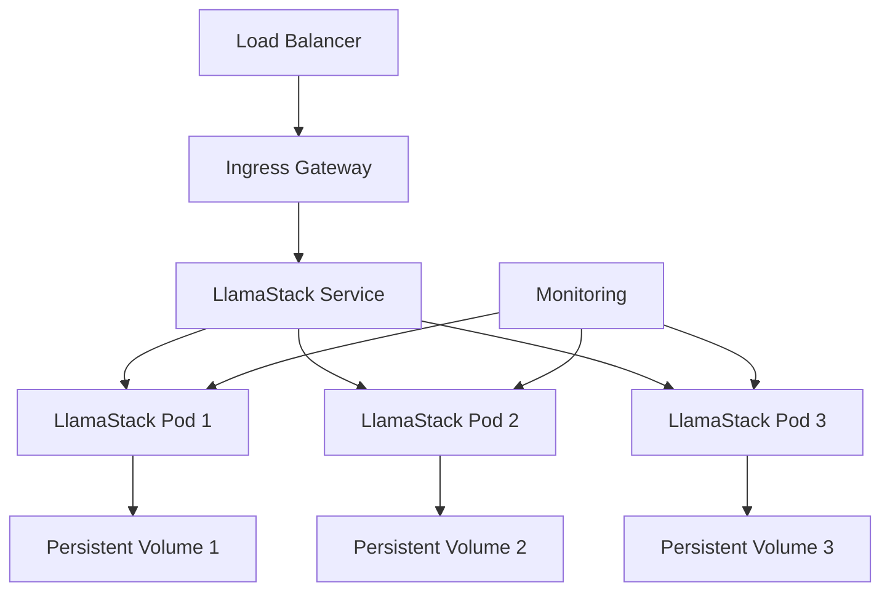

# Production Setup

Complete guide for deploying LlamaStack in production environments.

## Production Architecture

### High-Level Overview



### Infrastructure Requirements

- **Kubernetes**: v1.24+
- **Nodes**: 3+ worker nodes with GPU support
- **Storage**: High-performance SSD storage
- **Network**: Low-latency networking
- **Monitoring**: Prometheus + Grafana stack

## Production Configuration

### Complete Production Manifest

```yaml
apiVersion: llamastack.io/v1alpha1
kind: LlamaStackDistribution
metadata:
  name: llamastack-production
  namespace: llamastack-prod
  labels:
    app: llamastack
    environment: production
    version: v1.0.0
spec:
  # Image configuration
  image: llamastack/llamastack:v1.0.0
  imagePullPolicy: IfNotPresent
  imagePullSecrets:
  - name: registry-credentials
  
  # Scaling configuration
  replicas: 3
  strategy:
    type: RollingUpdate
    rollingUpdate:
      maxUnavailable: 1
      maxSurge: 1
  
  # Resource configuration
  resources:
    requests:
      cpu: "4"
      memory: "8Gi"
      nvidia.com/gpu: "1"
    limits:
      cpu: "8"
      memory: "16Gi"
      nvidia.com/gpu: "1"
  
  # Storage configuration
  storage:
    models:
      size: "1Ti"
      storageClass: "fast-ssd"
      mountPath: "/models"
      accessMode: ReadWriteOnce
    data:
      size: "500Gi"
      storageClass: "standard-ssd"
      mountPath: "/data"
      accessMode: ReadWriteMany
    cache:
      size: "100Gi"
      storageClass: "fast-ssd"
      mountPath: "/cache"
      accessMode: ReadWriteOnce
  
  # LlamaStack configuration
  config:
    models:
    - name: "llama2-70b-chat"
      path: "/models/llama2-70b-chat"
      provider: "meta-reference"
      config:
        max_seq_len: 4096
        max_batch_size: 4
    - name: "llama2-13b-chat"
      path: "/models/llama2-13b-chat"
      provider: "meta-reference"
      config:
        max_seq_len: 4096
        max_batch_size: 8
    
    inference:
      provider: "meta-reference"
      config:
        model: "llama2-70b-chat"
        max_tokens: 2048
        temperature: 0.7
        top_p: 0.9
    
    safety:
      provider: "llama-guard"
      config:
        model: "llama-guard-7b"
        enable_prompt_guard: true
        enable_response_guard: true
    
    memory:
      provider: "faiss"
      config:
        vector_store:
          provider: "faiss"
          config:
            dimension: 4096
            index_type: "IndexFlatIP"
  
  # Security configuration
  securityContext:
    runAsNonRoot: true
    runAsUser: 1000
    runAsGroup: 1000
    fsGroup: 1000
    seccompProfile:
      type: RuntimeDefault
  
  containerSecurityContext:
    allowPrivilegeEscalation: false
    readOnlyRootFilesystem: true
    capabilities:
      drop:
      - ALL
  
  # Scheduling configuration
  nodeSelector:
    node-type: "gpu"
    zone: "us-west-2a"
  
  tolerations:
  - key: "nvidia.com/gpu"
    operator: "Exists"
    effect: "NoSchedule"
  - key: "dedicated"
    operator: "Equal"
    value: "llamastack"
    effect: "NoSchedule"
  
  affinity:
    nodeAffinity:
      requiredDuringSchedulingIgnoredDuringExecution:
        nodeSelectorTerms:
        - matchExpressions:
          - key: "kubernetes.io/arch"
            operator: "In"
            values: ["amd64"]
          - key: "node-type"
            operator: "In"
            values: ["gpu"]
    podAntiAffinity:
      requiredDuringSchedulingIgnoredDuringExecution:
      - labelSelector:
          matchExpressions:
          - key: "app"
            operator: "In"
            values: ["llamastack"]
        topologyKey: "kubernetes.io/hostname"
  
  # Service configuration
  service:
    type: ClusterIP
    port: 8080
    targetPort: 8080
    annotations:
      prometheus.io/scrape: "true"
      prometheus.io/port: "9090"
      prometheus.io/path: "/metrics"
  
  # Ingress configuration
  ingress:
    enabled: true
    className: "nginx"
    annotations:
      nginx.ingress.kubernetes.io/rewrite-target: /
      nginx.ingress.kubernetes.io/ssl-redirect: "true"
      nginx.ingress.kubernetes.io/force-ssl-redirect: "true"
      cert-manager.io/cluster-issuer: "letsencrypt-prod"
    hosts:
    - host: "api.llamastack.example.com"
      paths:
      - path: "/"
        pathType: "Prefix"
    tls:
    - secretName: "llamastack-tls"
      hosts:
      - "api.llamastack.example.com"
  
  # Health checks
  healthCheck:
    livenessProbe:
      httpGet:
        path: "/health"
        port: 8080
      initialDelaySeconds: 60
      periodSeconds: 30
      timeoutSeconds: 10
      failureThreshold: 3
    readinessProbe:
      httpGet:
        path: "/ready"
        port: 8080
      initialDelaySeconds: 30
      periodSeconds: 10
      timeoutSeconds: 5
      failureThreshold: 3
  
  # Monitoring
  metrics:
    enabled: true
    port: 9090
    path: "/metrics"
    serviceMonitor:
      enabled: true
      interval: "30s"
      scrapeTimeout: "10s"
  
  # Environment variables
  env:
  - name: LLAMASTACK_LOG_LEVEL
    value: "INFO"
  - name: LLAMASTACK_METRICS_ENABLED
    value: "true"
  - name: LLAMASTACK_CACHE_ENABLED
    value: "true"
  - name: LLAMASTACK_MAX_WORKERS
    value: "4"
```

## Supporting Resources

### Namespace

```yaml
apiVersion: v1
kind: Namespace
metadata:
  name: llamastack-prod
  labels:
    name: llamastack-prod
    environment: production
```

### Storage Classes

```yaml
apiVersion: storage.k8s.io/v1
kind: StorageClass
metadata:
  name: fast-ssd
provisioner: kubernetes.io/aws-ebs
parameters:
  type: gp3
  iops: "10000"
  throughput: "1000"
allowVolumeExpansion: true
reclaimPolicy: Retain
---
apiVersion: storage.k8s.io/v1
kind: StorageClass
metadata:
  name: standard-ssd
provisioner: kubernetes.io/aws-ebs
parameters:
  type: gp3
  iops: "3000"
  throughput: "125"
allowVolumeExpansion: true
reclaimPolicy: Retain
```

### Network Policies

```yaml
apiVersion: networking.k8s.io/v1
kind: NetworkPolicy
metadata:
  name: llamastack-netpol
  namespace: llamastack-prod
spec:
  podSelector:
    matchLabels:
      app: llamastack
  policyTypes:
  - Ingress
  - Egress
  ingress:
  - from:
    - namespaceSelector:
        matchLabels:
          name: ingress-nginx
    - podSelector:
        matchLabels:
          app: prometheus
    ports:
    - protocol: TCP
      port: 8080
    - protocol: TCP
      port: 9090
  egress:
  - to: []
    ports:
    - protocol: TCP
      port: 53
    - protocol: UDP
      port: 53
  - to: []
    ports:
    - protocol: TCP
      port: 443
    - protocol: TCP
      port: 80
```

## Auto Scaling

### Horizontal Pod Autoscaler

```yaml
apiVersion: autoscaling/v2
kind: HorizontalPodAutoscaler
metadata:
  name: llamastack-hpa
  namespace: llamastack-prod
spec:
  scaleTargetRef:
    apiVersion: llamastack.io/v1alpha1
    kind: LlamaStackDistribution
    name: llamastack-production
  minReplicas: 3
  maxReplicas: 10
  metrics:
  - type: Resource
    resource:
      name: cpu
      target:
        type: Utilization
        averageUtilization: 70
  - type: Resource
    resource:
      name: memory
      target:
        type: Utilization
        averageUtilization: 80
  - type: Pods
    pods:
      metric:
        name: llamastack_active_requests
      target:
        type: AverageValue
        averageValue: "100"
  behavior:
    scaleUp:
      stabilizationWindowSeconds: 300
      policies:
      - type: Percent
        value: 50
        periodSeconds: 60
    scaleDown:
      stabilizationWindowSeconds: 300
      policies:
      - type: Percent
        value: 25
        periodSeconds: 60
```

### Vertical Pod Autoscaler

```yaml
apiVersion: autoscaling.k8s.io/v1
kind: VerticalPodAutoscaler
metadata:
  name: llamastack-vpa
  namespace: llamastack-prod
spec:
  targetRef:
    apiVersion: llamastack.io/v1alpha1
    kind: LlamaStackDistribution
    name: llamastack-production
  updatePolicy:
    updateMode: "Auto"
  resourcePolicy:
    containerPolicies:
    - containerName: llamastack
      maxAllowed:
        cpu: "16"
        memory: "32Gi"
      minAllowed:
        cpu: "2"
        memory: "4Gi"
      controlledResources: ["cpu", "memory"]
```

## Monitoring Setup

### ServiceMonitor

```yaml
apiVersion: monitoring.coreos.com/v1
kind: ServiceMonitor
metadata:
  name: llamastack-monitor
  namespace: llamastack-prod
spec:
  selector:
    matchLabels:
      app: llamastack
  endpoints:
  - port: metrics
    interval: 30s
    path: /metrics
    scrapeTimeout: 10s
```

### PrometheusRule

```yaml
apiVersion: monitoring.coreos.com/v1
kind: PrometheusRule
metadata:
  name: llamastack-alerts
  namespace: llamastack-prod
spec:
  groups:
  - name: llamastack.rules
    rules:
    - alert: LlamaStackDown
      expr: up{job="llamastack"} == 0
      for: 1m
      labels:
        severity: critical
      annotations:
        summary: "LlamaStack instance is down"
        description: "LlamaStack instance {{ $labels.instance }} has been down for more than 1 minute."
    
    - alert: HighErrorRate
      expr: rate(llamastack_requests_total{status=~"5.."}[5m]) > 0.1
      for: 5m
      labels:
        severity: warning
      annotations:
        summary: "High error rate detected"
        description: "Error rate is {{ $value }} errors per second."
    
    - alert: HighLatency
      expr: histogram_quantile(0.95, rate(llamastack_request_duration_seconds_bucket[5m])) > 5
      for: 5m
      labels:
        severity: warning
      annotations:
        summary: "High latency detected"
        description: "95th percentile latency is {{ $value }} seconds."
```

## Backup Strategy

### Automated Backups

```yaml
apiVersion: batch/v1
kind: CronJob
metadata:
  name: llamastack-backup
  namespace: llamastack-prod
spec:
  schedule: "0 2 * * *"  # Daily at 2 AM
  jobTemplate:
    spec:
      template:
        spec:
          containers:
          - name: backup
            image: velero/velero:latest
            command:
            - /bin/sh
            - -c
            - |
              velero backup create llamastack-$(date +%Y%m%d-%H%M%S) \
                --include-namespaces llamastack-prod \
                --storage-location default \
                --ttl 720h0m0s
          restartPolicy: OnFailure
```

## Security Hardening

### Pod Security Policy

```yaml
apiVersion: policy/v1beta1
kind: PodSecurityPolicy
metadata:
  name: llamastack-psp
spec:
  privileged: false
  allowPrivilegeEscalation: false
  requiredDropCapabilities:
    - ALL
  volumes:
    - 'configMap'
    - 'emptyDir'
    - 'projected'
    - 'secret'
    - 'downwardAPI'
    - 'persistentVolumeClaim'
  runAsUser:
    rule: 'MustRunAsNonRoot'
  seLinux:
    rule: 'RunAsAny'
  fsGroup:
    rule: 'RunAsAny'
```

### RBAC

```yaml
apiVersion: rbac.authorization.k8s.io/v1
kind: Role
metadata:
  namespace: llamastack-prod
  name: llamastack-role
rules:
- apiGroups: [""]
  resources: ["configmaps", "secrets"]
  verbs: ["get", "list", "watch"]
- apiGroups: [""]
  resources: ["pods"]
  verbs: ["get", "list", "watch"]
---
apiVersion: rbac.authorization.k8s.io/v1
kind: RoleBinding
metadata:
  name: llamastack-rolebinding
  namespace: llamastack-prod
subjects:
- kind: ServiceAccount
  name: llamastack
  namespace: llamastack-prod
roleRef:
  kind: Role
  name: llamastack-role
  apiGroup: rbac.authorization.k8s.io
```

## Deployment Process

### 1. Pre-deployment Checklist

- [ ] Kubernetes cluster ready (v1.24+)
- [ ] GPU nodes available and labeled
- [ ] Storage classes configured
- [ ] Monitoring stack deployed
- [ ] Ingress controller configured
- [ ] TLS certificates ready
- [ ] Image registry accessible
- [ ] Backup solution configured

### 2. Deployment Steps

```bash
# 1. Create namespace
kubectl apply -f namespace.yaml

# 2. Create storage classes
kubectl apply -f storage-classes.yaml

# 3. Create RBAC resources
kubectl apply -f rbac.yaml

# 4. Create network policies
kubectl apply -f network-policies.yaml

# 5. Deploy LlamaStack
kubectl apply -f llamastack-production.yaml

# 6. Create HPA
kubectl apply -f hpa.yaml

# 7. Create monitoring resources
kubectl apply -f monitoring.yaml

# 8. Verify deployment
kubectl get llamastackdistribution -n llamastack-prod
kubectl get pods -n llamastack-prod
```

### 3. Post-deployment Verification

```bash
# Check pod status
kubectl get pods -n llamastack-prod -l app=llamastack

# Check service endpoints
kubectl get endpoints -n llamastack-prod

# Test health endpoints
kubectl exec -n llamastack-prod -it <pod-name> -- curl http://localhost:8080/health

# Check metrics
kubectl port-forward -n llamastack-prod svc/llamastack-production 9090:9090
curl http://localhost:9090/metrics

# Test ingress
curl -k https://api.llamastack.example.com/health
```

## Maintenance

### Rolling Updates

```bash
# Update image version
kubectl patch llamastackdistribution llamastack-production -n llamastack-prod \
  -p '{"spec":{"image":"llamastack/llamastack:v1.1.0"}}'

# Monitor rollout
kubectl rollout status deployment/llamastack-production -n llamastack-prod
```

### Scaling Operations

```bash
# Manual scaling
kubectl scale llamastackdistribution llamastack-production -n llamastack-prod --replicas=5

# Check HPA status
kubectl get hpa -n llamastack-prod
```

### Backup and Recovery

```bash
# Manual backup
velero backup create llamastack-manual --include-namespaces llamastack-prod

# List backups
velero backup get

# Restore from backup
velero restore create --from-backup llamastack-20240101-120000
```

## Next Steps

- [Custom Images Guide](custom-images.md)
- [Monitoring Setup](../how-to/monitoring.md)
- [Scaling Guide](../how-to/scaling.md)
- [Troubleshooting](../how-to/troubleshooting.md)
