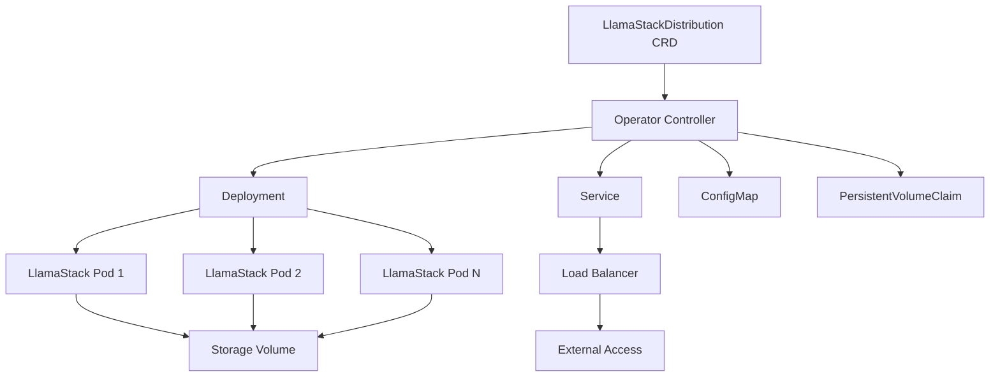

# LlamaStack Kubernetes Operator

The LlamaStack Kubernetes Operator provides a simple and efficient way to deploy and manage LlamaStack distributions in Kubernetes clusters.

## Overview

LlamaStack is a comprehensive framework for building AI applications with Large Language Models (LLMs). This Kubernetes operator simplifies the deployment and management of LlamaStack distributions, providing:

- **Easy Deployment**: Deploy LlamaStack with a single Kubernetes resource
- **Scalability**: Automatically scale LlamaStack instances based on demand
- **Storage Management**: Persistent storage for models and data
- **Configuration Management**: Flexible configuration options for different use cases
- **Monitoring**: Built-in observability and health checks

## Quick Start

Get started with the LlamaStack Operator in just a few steps:

1. **Install the Operator**
   ```bash
   kubectl apply -f https://github.com/llamastack/llama-stack-k8s-operator/releases/latest/download/operator.yaml
   ```

2. **Deploy a LlamaStack Instance**
   ```yaml
   apiVersion: llamastack.io/v1alpha1
   kind: LlamaStackDistribution
   metadata:
     name: my-llamastack
   spec:
     replicas: 1
     server:
       distribution:
         name: "starter"
       containerSpec:
         port: 8321
         resources:
           requests:
             memory: "2Gi"
             cpu: "1"
   ```

3. **Apply the Configuration**
   ```bash
   kubectl apply -f llamastack.yaml
   ```

## Key Features

### 🚀 **Simple Deployment**
Deploy LlamaStack distributions with minimal configuration using Kubernetes-native resources.

### 📈 **Auto-scaling**
Automatically scale your LlamaStack instances based on resource utilization and demand.

### 💾 **Persistent Storage**
Built-in support for persistent storage to maintain models, cache, and application data.

### 🔧 **Flexible Configuration**
Support for multiple LlamaStack distributions and custom container images.

### 📊 **Observability**
Integrated monitoring, logging, and health checks for production deployments.

### 🔒 **Security**
Security best practices with RBAC, network policies, and secure defaults.

## Architecture



## Use Cases

### Development and Testing
- Quick setup for development environments
- Testing different LlamaStack configurations
- Prototyping AI applications

### Production Deployments
- Scalable LlamaStack deployments
- High availability configurations
- Enterprise-grade security and monitoring

### Multi-tenant Environments
- Isolated LlamaStack instances per team
- Resource quotas and limits
- Namespace-based separation

## Getting Started

Ready to get started? Check out our comprehensive guides:

- [Installation Guide](getting-started/installation.md) - Install the operator in your cluster
- [Quick Start Tutorial](getting-started/quick-start.md) - Deploy your first LlamaStack instance
- [Configuration Guide](getting-started/configuration.md) - Learn about configuration options

## Documentation

- **[API Reference](reference/api.md)** - Complete API documentation
- **[How-to Guides](how-to/deploy-llamastack.md)** - Task-oriented guides
- **[Examples](examples/basic-deployment.md)** - Real-world configuration examples
- **[Contributing](contributing/development.md)** - Development and contribution guide

## Community

- **GitHub**: [llamastack/llama-stack-k8s-operator](https://github.com/llamastack/llama-stack-k8s-operator)
- **Issues**: [Report bugs and request features](https://github.com/llamastack/llama-stack-k8s-operator/issues)
- **Discussions**: [Community discussions](https://github.com/llamastack/llama-stack-k8s-operator/discussions)

## License

This project is licensed under the Apache License 2.0. See the [LICENSE](https://github.com/llamastack/llama-stack-k8s-operator/blob/main/LICENSE) file for details.
